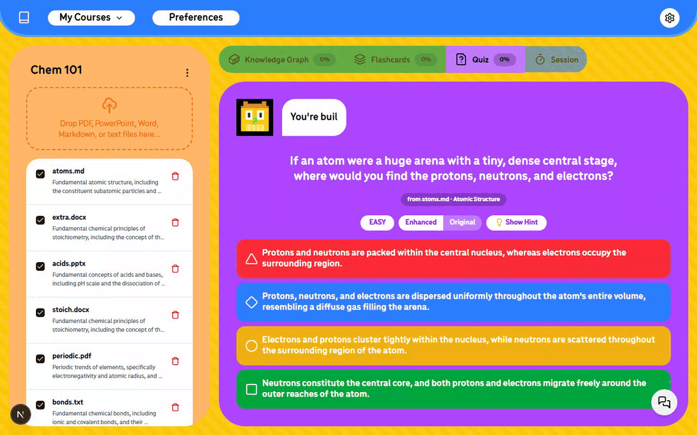
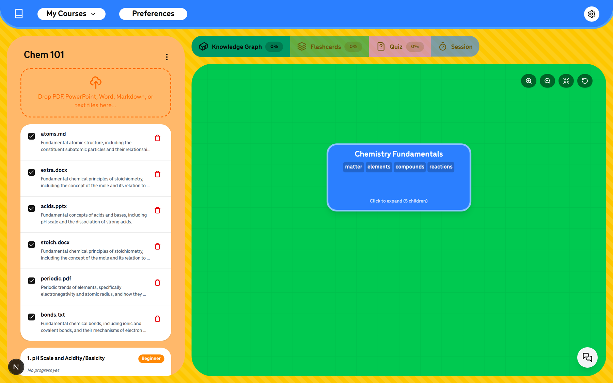
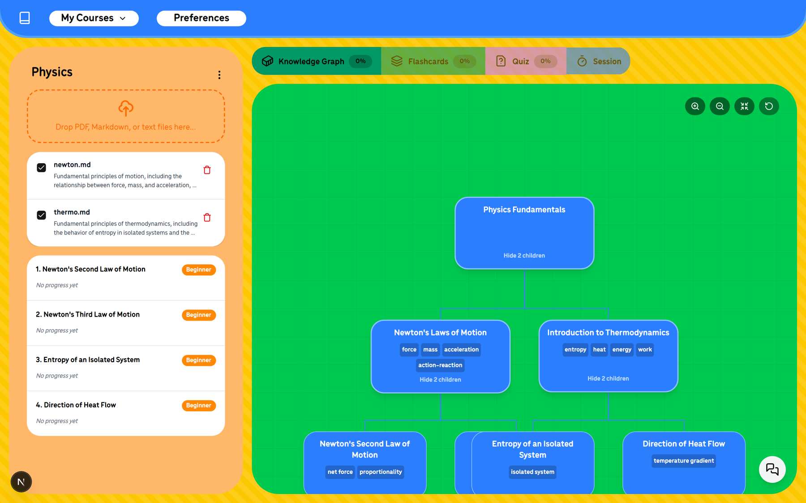
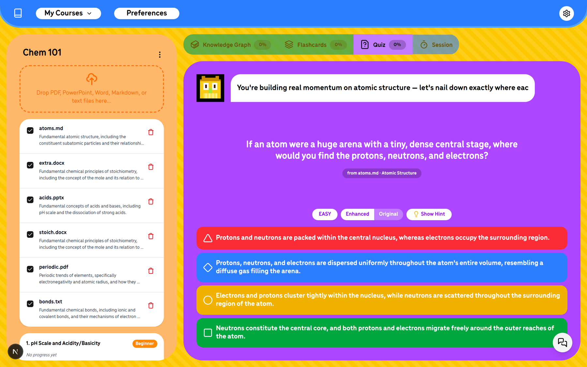

<div align="center">

# ai-adaptive-learning

### Point it at a folder of notes. Get a tutor that actually adapts.

A local-first study app. Your notes stay a folder on your machine; the app
reads them, builds a knowledge graph, and quizzes you with questions that
get harder when you're right and gentler when you're struggling —
flashcards appear exactly where your mistakes do.

[](https://nodejs.org) [](https://nextjs.org) [](#your-data) [](#setup)



</div>

---

## The loop

**1. Tell it how you learn.** One-time preferences — language level, analogy
style, wording — and every question is phrased for you.



**2. It maps what your notes actually contain.** Every file becomes concepts;
concepts become a graph you can drag, expand, and explore.



**3. Study.** Adaptive multiple-choice with hints, explanations for wrong
answers, and flashcards generated from your weak spots — scheduled with
FSRS so reviews land right before you'd forget.



## What it reads

| Type | Notes |
|---|---|
| `.md` | Best support — headings become structure and citations |
| `.pdf` | Text extraction — scanned/image-only PDFs come out near-empty |
| `.pptx` | Lecture slides — every slide becomes a cited "Slide N" section |
| `.docx` | Headings preserved, so citations point at the right section |
| `.txt` | Full support |

Top-level subfolders become courses. Files at the root become a course
called "Notes". Edits, adds and deletes are picked up live — and concepts
are cached by content, so deleting a file and adding it back (or renaming
it) restores your course instantly with progress intact.

## Limits worth knowing

- Files are processed in **20,000-character chunks** (~5k tokens, 1k
  overlap) for concept extraction, so single files of any length work —
  but a 500-page scanned PDF with no text layer yields nothing.
- The tutor reads the **full text of the files you select** when it builds
  a session, so "select all" on a very large course can exceed the model's
  context window. Select the files you're studying.
- Knowledge graphs batch **80 concepts at a time**; enormous courses
  produce graphs in passes, not all at once.

## Setup

One command — no clone, no build:

```bash
npx ai-adaptive-learning ~/my-notes
```

First run asks which AI provider to use and for its key (saved locally,
owner-only permissions, never asked again), then your browser opens.
Point it at any folder — or at nothing, and drop files in later.

Prefer a desktop app? The Windows installer gives you an icon, a window,
and a `Documents/StudyNotes` folder it opens for you on first launch —
grab it from [Releases](https://github.com/kan2k/ai-adaptive-learning/releases). macOS/Linux builds come from the same codebase.

**Providers:** OpenRouter (default — one key, 300+ models), OpenAI,
Anthropic, Google AI Studio, Groq, DeepSeek, Mistral, Together,
**Ollama (fully offline, free)**, or any OpenAI-compatible endpoint.
Switch any time from the gear icon — changes apply instantly, no restart.

<details>
<summary>Running from source instead</summary>

```bash
git clone https://github.com/kan2k/ai-adaptive-learning.git
cd ai-adaptive-learning
npm install
cp .env.example .env.local   # add ONE key
npm run dev                  # → http://localhost:3000
```

</details>

Everything is also configurable by env for power users:

| | |
|---|---|
| `STUDY_DIR` | The notes folder to study (default `./notes`) |
| `LLM_PROVIDER` | Any provider above (default `openrouter`) |
| `LLM_API_KEY` | The key for that provider |
| `LLM_BASE_URL` | For `custom`/`ollama` endpoints |
| `LLM_MODEL_FAST` / `LLM_MODEL_SMART` | Override the content/tutor models |

## What it costs

Measured, not estimated: the app logs every LLM call's tokens (see them in
`.study/logs/app.log`). One full session — indexing five files, starting a
course, a quiz turn with a wrong-answer explanation, and a tutor chat —
measured 19k tokens on the fast tier and 191k on the smart tier. At
OpenRouter's current prices:

| Smart model | That session | A month of daily study* |
|---|---|---|
| `deepseek/deepseek-v4.1-flash` (default) | ~$0.03 | **~$1** |
| `z-ai/glm-5.3-flash` | ~$0.06 | ~$2 |
| `anthropic/claude-sonnet-5` (premium, opt-in) | ~$0.51 | ~$15 |

*30 sessions. File indexing is one-time per file; re-studying the same
notes costs only the tutor turns. `OLLAMA_BASE_URL` makes all of it $0.

<a id="your-data"></a>

## Your data

Everything lives in your notes folder. The app writes one hidden
subdirectory — `.study/` — holding a SQLite database (progress, flashcards,
chat history) and debug logs. Copy the folder, you've copied your whole
study state. Delete `.study/`, you've reset it. Nothing leaves your machine
except the text sent to the LLM you configured.

## Debugging

`GET /api/debug` shows the models in use, what's still processing, and the
recent error log. The full history is at `<your folder>/.study/logs/app.log`.

## License

[Apache-2.0](LICENSE).
